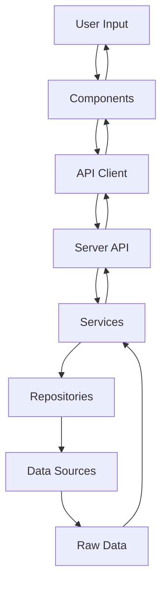

# MyGO Searcher 架構文檔

## 系統架構概覽

MyGO Searcher 是一個基於 Nuxt 3 的全端應用。

以下是技術架構文檔，我叫Claude寫的，怎樣我就懶得寫文檔嘛。

## Tech Stack

### 前端

- **框架**: Vue 3 + Nuxt 3
- **樣式**: UnoCSS + 自定義主題
- **UI組件**: Element Plus
- **狀態管理**: Nuxt 3 Composables
- **類型系統**: TypeScript

### 後端

- **運行時**: Nuxt 3 Server (基於 H3)
- **資料庫**: MongoDB (可選) + 本地JSON文件
- **搜尋引擎**: 自定義實現 (Levenshtein距離算法)
- **快取**: 內存快取 + 檔案快取

### 部署

- **容器化**: Docker
- **靜態資源**: 本地檔案系統
- **環境配置**: 環境變數管理
- **資料庫**: MongoDB (可選，支援本地文件fallback)

## 目錄結構

```tree
MyGO-Searcher/
├── apis/                   # 前端API客戶端
│   ├── base.ts            # 基礎API調用
│   └── client.ts          # HTTP客戶端封裝
├── components/            # Vue組件
│   ├── popup/             # 彈窗組件
│   ├── card/              # 卡片組件
│   └── *.vue              # 其他通用組件
├── composables/           # Vue Composables
│   └── common.ts          # 通用邏輯
├── pages/                 # 頁面路由
├── server/                # 後端服務
│   ├── api/               # API路由
│   │   ├── v1/            # 新版API (RESTful)
│   │   └── mygo/          # 舊版API (向後兼容)
│   ├── services/          # 業務邏輯層
│   ├── repositories/      # 資料存取層
│   ├── config/            # 配置管理
│   ├── types/             # 後端類型定義
│   ├── utils/             # 工具函數
│   └── algo/              # 演算法實現
├── types/                 # 前端類型定義
├── styles/                # 樣式文件
├── public/                # 靜態資源
│   └── data/              # 圖片資料
└── docs/                  # 文檔
```

## 分層架構設計

### 1. 展示層 (Presentation Layer)

**位置**: `components/`, `pages/`
**職責**:

- 用戶介面渲染
- 用戶交互處理
- 狀態管理

**主要組件**:

- `SearchBar.vue`: 搜尋功能
- `Filter.vue`: 篩選功能  
- `ViewPanel.vue`: 圖片展示
- `ImageView.vue`: 單張圖片組件

### 2. API層 (API Layer)

**位置**: `server/api/`
**職責**:

- HTTP請求處理
- 參數驗證
- 回應格式化
- 錯誤處理

**版本管理**:

- `v1/`: 新版RESTful API
- `mygo/`: 舊版API (向後兼容)

### 3. 服務層 (Service Layer)

**位置**: `server/services/`
**職責**:

- 業務邏輯實現
- 資料處理
- 快取管理
- 第三方服務集成

**主要服務**:

- `ImageService`: 圖片管理
- `SearchService`: 搜尋邏輯
- `PopularityService`: 人氣統計

### 4. 存儲庫層 (Repository Layer)

**位置**: `server/repositories/`
**職責**:

- 資料存取抽象
- 資料來源切換
- 資料一致性保證

**實現**:

- `FileRepository`: 本地檔案存取
- `MongoRepository`: MongoDB存取

### 5. 配置層 (Configuration Layer)

**位置**: `server/config/`
**職責**:

- 環境配置管理
- 資料庫連接
- 運行時配置

## 資料流



## 核心功能模組

### 搜尋引擎

**實現**: `server/algo/levenshtein.ts`
**特性**:

- 中文繁簡體轉換 (OpenCC)
- 模糊匹配算法
- 相似度評分
- 自定義關鍵字映射

### 圖片管理系統

**實現**: `server/services/imageService.ts`
**特性**:

- 分頁支援
- 多種排序方式
- 快取優化
- 篩選功能
