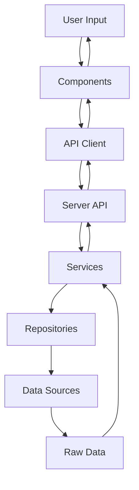

# MyGO Searcher 架構文檔

## 系統架構概覽

MyGO Searcher 是一個基於 Nuxt 4 的全端應用。

以下是技術架構文檔，我叫Claude寫的，怎樣我就懶得寫文檔嘛。

## Tech Stack

### 前端

- **框架**: Vue 3 + Nuxt 4
- **樣式**: UnoCSS + 自定義主題
- **UI組件**: Nuxt UI + Element Plus
- **狀態管理**: Vue Composables
- **類型系統**: TypeScript

### 後端

- **運行時**: Nuxt 4 Nitro Server (基於 H3)
- **資料庫**: MongoDB (可選) + 本地JSON文件
- **搜尋引擎**: metadata 關鍵字搜尋、Levenshtein 模糊搜尋與實驗性語義搜尋
- **快取**: 語義搜尋索引檔案快取

### 部署

- **容器化**: Docker
- **圖片儲存**: Cloudflare R2
- **環境配置**: 環境變數管理
- **資料庫**: MongoDB (可選，支援本地文件fallback)

## 目錄結構

```tree
MyGO-Searcher/
├── app/                    # Nuxt前端應用
│   ├── apis/              # API客戶端
│   ├── components/        # Vue組件
│   ├── composables/       # Vue Composables
│   ├── pages/             # 頁面路由
│   ├── types/             # 前端類型定義
│   └── utils/             # 前端篩選等工具函數
├── server/                # 後端服務
│   ├── api/               # API路由
│   │   ├── v1/            # 新版API (RESTful)
│   │   └── mygo/          # 舊版API (向後兼容)
│   ├── services/          # 業務邏輯層
│   ├── repositories/      # 資料存取層
│   ├── config/            # 配置管理
│   ├── types/             # 後端類型定義
│   ├── utils/             # 工具函數
│   └── algo/              # 演算法實現
├── public/                # 靜態資源
│   └── data/              # 圖片metadata與關鍵字映射
├── tests/                 # 測試
└── docs/                  # 文檔
```

## 分層架構設計

### 1. 展示層 (Presentation Layer)

**位置**: `app/components/`, `app/pages/`
**職責**:

- 用戶介面渲染
- 用戶交互處理
- 狀態管理

**主要組件**:

- `search-bar.vue`: 搜尋功能
- `popup/filter.vue`: 篩選功能
- `main-view-panel.vue`: 圖片列表
- `image-view-card.vue`: 單張圖片卡片

### 2. API層 (API Layer)

**位置**: `server/api/`
**職責**:

- HTTP請求處理
- 參數驗證
- 回應格式化
- 錯誤處理

**版本管理**:

- `v1/`: 新版RESTful API
- `mygo/`: 舊版API (向後兼容)

### 3. 服務層 (Service Layer)

**位置**: `server/services/`
**職責**:

- 業務邏輯實現
- 資料處理
- 快取管理
- 第三方服務集成

**主要服務**:

- `ImageService`: 圖片管理
- `SearchService`: 搜尋邏輯
- `PopularityService`: 人氣統計

### 4. 存儲庫層 (Repository Layer)

**位置**: `server/repositories/`
**職責**:

- 資料存取抽象
- 資料來源切換
- 資料一致性保證

**實現**:

- `FileRepository`: 本地檔案存取
- `MongoRepository`: MongoDB存取

### 5. 配置層 (Configuration Layer)

**位置**: `server/config/`
**職責**:

- 環境配置管理
- 資料庫連接
- 運行時配置

## 資料流


```mermaid
graph TD;
    A[User Input] --> B[Components];
    B --> C[API Client];
    C --> D[Server API];
    D --> E[Services];
    E --> F[Repositories];
    F --> G[Data Sources];
    G --> H[Raw Data];
    H --> E;
    E --> D;
    D --> C;
    C --> B;
    B --> A;
```

## 核心功能模組

### 搜尋引擎

**實現**: `server/utils/search/`、`server/algo/levenshtein.ts`
**特性**:

- 中文繁簡體轉換 (OpenCC)
- 模糊匹配算法
- 相似度評分
- 自定義關鍵字映射
- 台詞、描述、人物、標籤與集數 metadata 搜尋
- 可選的 Transformers.js 語義搜尋

### 圖片管理系統

**實現**: `server/services/imageService.ts`
**特性**:

- 分頁支援
- 多種排序方式
- MongoDB 與本地 JSON fallback
- UUID Object Key 與 R2 CDN URL 解析
